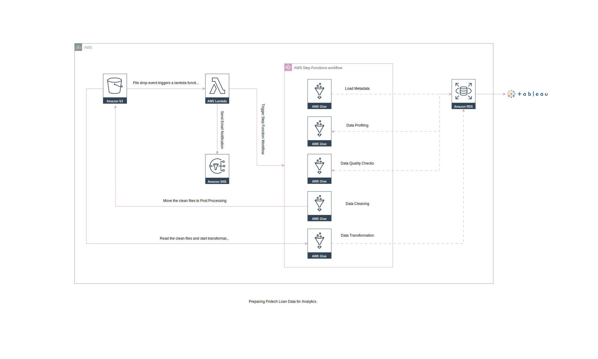

## Process Architecture:

## Tools Selection and Use
* AWS Lambda: Employed for processing data as it arrives in S3, handling functions such as data validation, transformation and quality checks.
* AWS S3: Used for storing raw data files. S3 was chosen for its scalability, cost-effectiveness and integration with other AWS services, making it easy to store, retrieve and manage large datasets.
* AWS Step functions: Step Functions will orchestrate and manage our ETL pipeline, controlling the sequence of tasks, from data validation to transformation and loading.
* AWS RDS: Used to store cleaned and transformed data in a relational database format that supports multidimensional analysis.
* AWS Glue: Provides a serverless framework to run our metada loading, data profiling, dq checks, cleaning, and transformations 
* Great Expectations: Used for enhanced data validation and quality checks beyond the capabilities of AWS Glue. We chose this tool for its flexibility in defining custom rules and generating detailed reports on data quality, which is crucial for maintaining high standards in data accuracy.
* Tableau: Selected for developing interactive dashboards to visualize key findings. Tableau was chosen over alternatives for its powerful visual analytics capabilities and ease of use in creating dashboards that facilitate exploratory data analysis and storytelling.
